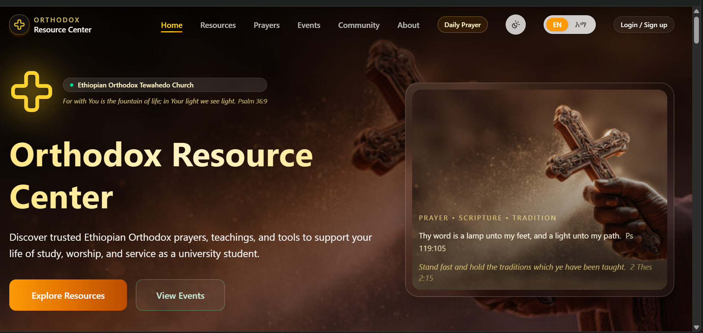

# Orthodox Resource Center

Orthodox Resource Center is a full‑stack web application for exploring and accessing Ethiopian Orthodox Church resources.  
It organizes teachings, liturgy materials, history, saints’ lives, commentaries, and scriptural resources into clear categories and types for easy browsing.

---

## Screenshot

## Features

### For Students / Users

- **Events timeline with RSVP**
  - View upcoming liturgies, Bible studies, fellowships, and campus gatherings with date, time, location, and description.
  - Simple RSVP so students can indicate they’re attending.

- **Prayers section with in‑app viewer**
  - Cards for daily and communal prayers with image, time, and summary.
  - Read prayer texts inside a modal viewer (HTML or iframe) without leaving the app.

- **Resource library (spiritual media)**
  - Categorized resources: Scripture & study, teachings, spiritual life, liturgy, saints & history, youth & campus, media.
  - Category-based filtering: Scripture & study, teachings, spiritual life, liturgy, saints & history, youth & campus, media.
  - In‑app viewer for PDFs, videos, audio, and web links using iframes.

- **Community and contact**
  - Community section highlighting weekly gatherings, study circles, and student fellowship.
  - Contact form for questions, prayer requests, or interest in local groups.

- **My Messages (Q&A threads)**
  - See all previous questions and replies from admins in one place.
  - Chat-style threads showing messages from “you” and from “admin” with timestamps.
  - Automatic updates via polling (new admin replies appear without page reload).

- **Theme and language**
  - Light/dark theme toggle for comfortable reading in different environments.
  - English/Amharic language toggle for both UI texts and many content fields.

- **Mobile-friendly UI**
  - Fully responsive layout for phones, tablets, and desktops.
  - Grids, cards, and modals adapt to smaller screens while keeping close buttons and content visible.

### For Admins / Organizers

- **Admin dashboard**
  - Tabs for Resources, Events, Prayers, Messages, and RSVPs.
  - Manage all content from the browser—no code changes required.

- **Resource management**
  - Create, edit, and delete resources with categories, types, and bilingual fields.
  - Control which items appear in the public library.

- **Event management and RSVPs**
  - Create and update events with rich details (date, time, location, description, image).
  - View RSVPs per event in a dedicated panel.

- **Prayer management**
  - Create and edit prayers with EN/AM fields, images, time, and linked HTML/text content.
  - Ensure readable prayer layouts inside the app’s viewer.

- **Message management**
  - View contact messages as threads.
  - Reply to student questions, change status (pending/answered/closed), and support campus spiritual life.

- **Authentication & roles**
  - Login/registration with JWT-based authentication.
  - Admin-only access to dashboard and management routes.

---

## Technologies used

**Frontend**

- React
- JavaScript (ES6+)
- HTML & CSS
- Tailwind CSS

**Backend**

- Node.js
- Express

**General**

- Git & GitHub
- npm for dependency management

---

## Getting started

### Prerequisites

- Node.js and npm installed.
- Git installed.
- MongoDB instance (local or remote)

### Basic Setup (development)

- Clone the repository

- git clone [<repo-url>](https://github.com/esubaleww/church_resources_library)
- cd church_resources_library
- Install dependencies

# frontend

- npm install

# backend

- cd backend
- npm install

# Configure environment

-Backend: set MongoDB URI, JWT secret, and port in your server config or .env.

-Frontend: currently using http://localhost:5000 directly in fetch calls for the API.

-Run the app

# backend

-npm run backend

# frontend

npm run dev
Then open the dev URL (e.g. http://localhost:5173) in your browser.

---

## Core concepts

- **Resources:** items such as sermons, liturgy texts, hymn audio, historical documents, saints’ stories, and scriptural commentaries, videos, scriptures...
- **Categories:** top‑level grouping (e.g. Liturgy, Teachings, History, Saints, Scriptures, Commentaries).
- **Types:** format or medium (e.g. audio, text, PDF, video, etc.).
- **Prayers:**
  Entries that point to HTML/text content, rendered inside a modal for focused reading. Support bilingual content (EN/AM).

- **Events & RSVPs:**
  Event objects with date, time, location, description, and optional image. RSVPs stored per event so admins can see who plans to attend.

- **Contact Threads / Messages:**
  Each submission from the contact form creates a thread.
  Threads store the original question and an array of replies (author: "admin" | "user"), which power both the admin Messages tab and the user “My Messages” page.

The UI is designed to help users quickly navigate through categories and types to find the Orthodox resources they need.

---

## Roadmap / future improvements

-Real‑time updates via Server‑Sent Events or WebSockets (instead of polling) for messages and RSVPs.
-Favorites / playlists for frequently used liturgy, teachings, and prayers.
-Analytics for organizers (most viewed resources, event attendance).
-Offline caching for key prayers and core resources.
-More content and better content discovery (e.g. recommended resources or daily reading plans).
